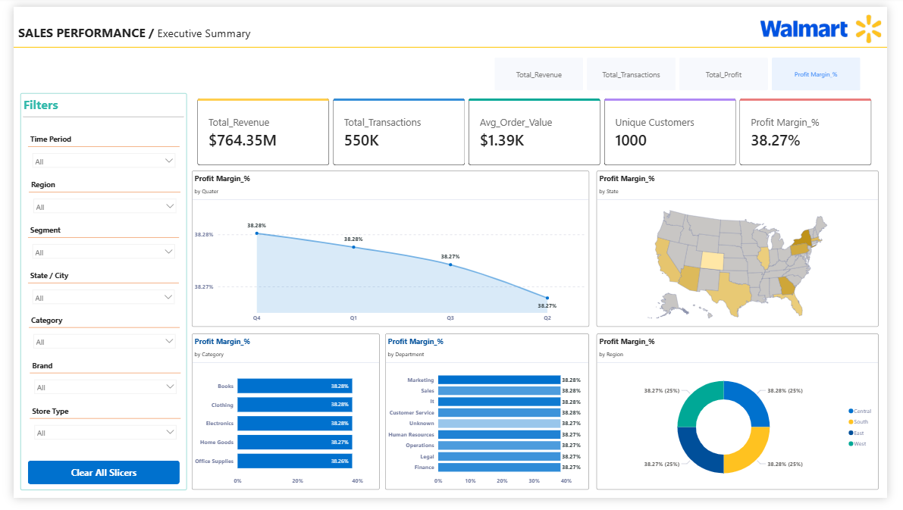

# Walmart-Sales-Dashboard

This Power BI report provides end-to-end sales analytics for Walmart retail operations. Built across two report pages - Executive Summary and Product & Customer Insights. The dashboard tracks 15+ DAX measures including Total Revenue, Profit Margin %, Average Order Value, and Year-over-Year variance across Revenue, Profit, and Transactions.

The data model follows a star-schema design with 6 tables (Calendar, Customer, Product, Store, Employee, and Measures), enabling multi-dimensional slicing by region, store type, product category, customer segment, and time period. Visuals include KPI cards, bar/area charts, a U.S. state-level shape map, donut charts, and pivot tables — all styled with a custom Walmart brand theme.

## Dashboard Preview

### Executive Summary

### Product & Customer Insights

